# SurplusBites

**SurplusBites** is a mobile app designed to reduce food and product waste by connecting consumers with local businesses offering surplus food at discounted prices. Built using Flutter and Firebase, the app helps minimize wastage through real-time inventory management, geolocation-based food offers, and community engagement.


## Figma UI Design

To explore the Figma prototype and UI design of SurplusBites, click the link below:

[**View Figma Design**](https://www.figma.com/design/IjmgJBFSYRsZrmvXHX6ZAD/SurplusByte?node-id=1669-162202&t=mLcQiwVYNGGQ23xz-1)

### Screenshots


<p align="center">
  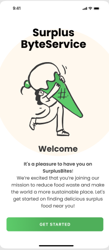
  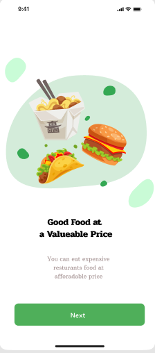
  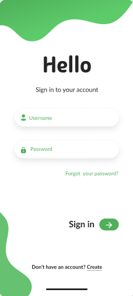
  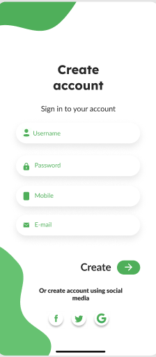
   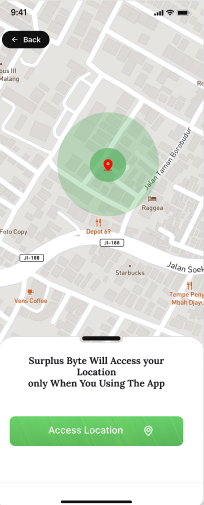
    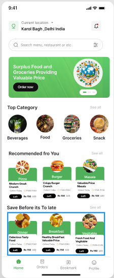
     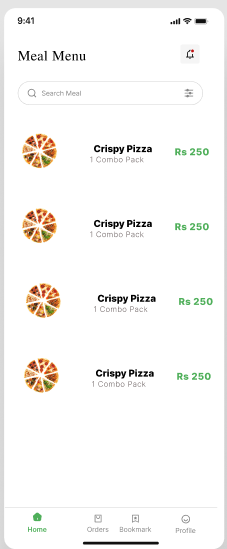
     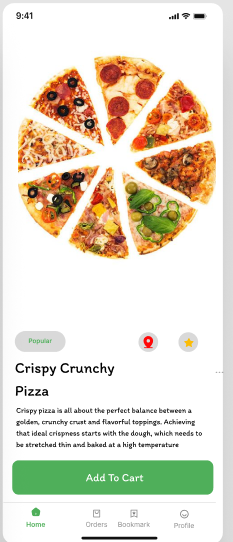
     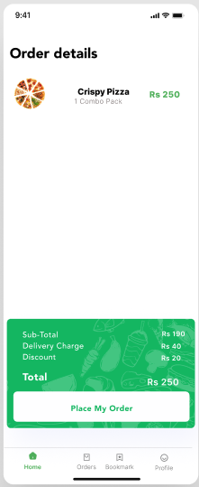
     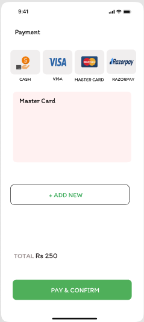
     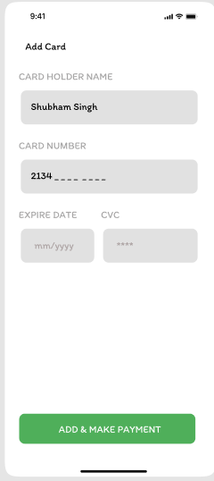
     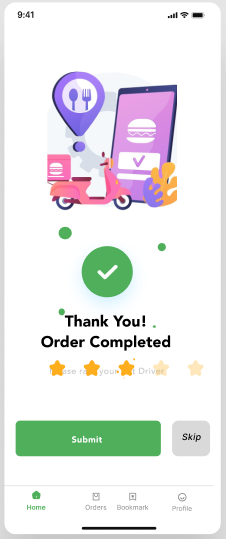
</p>


## Features

1. **Connecting Consumers with Surplus Food**  
   - Local businesses list unsold perishable food nearing expiration.
   - Consumers can browse and purchase these items at discounted rates, reducing waste.

2. **Real-Time Inventory Management**  
   - Businesses manage surplus inventory in real-time using the app's dashboard.
   - Helps prevent wastage by promoting surplus food quickly.

3. **Geolocation-Based Offers**  
   - Users are shown nearby businesses offering surplus food through geolocation.
   - Ensures fast pickup and consumption before the food spoils.

4. **Community Engagement**  
   - Users can share recipes and tips for creatively using surplus food.
   - Promotes sustainability and reduces household food waste.

5. **Consumer Incentives**  
   - Users earn points for purchases, which can be redeemed for discounts.
   - Incentivizes regular use of the app and purchasing surplus items.

## Business Model

1. **Commission Model**: SurplusBites takes a commission from each sale.
2. **Subscription Model**: Businesses can subscribe for enhanced inventory management and promotion features.

## Tech Stack

- **Mobile App**: Flutter
- **Backend**: Firebase (Firestore, Authentication, Cloud Functions)
- **Payments**: Razorpay, VISA, MasterCard

## How to Install and Run

### Prerequisites:
- Flutter SDK
- Firebase Account for backend services

### Steps:
1. Clone the repository:
   ```bash
   git clone https://github.com/your-repo/surplusbites.git

### Command After Clone Reposatory :

- cd surplusbites


- flutter pub get

- flutter run
